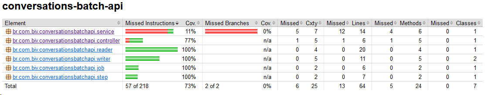

## API Conversations Batch

API criada com objetivo de ler registros de arquivo (csv), armazenar os dados em um banco de dados e gerenciar
conversas.

### :wrench: Tecnologias utilizadas

- Linguagens [Java 11, Javascript, CSS e HTML]
- Frameworks [SpringBoot, SpringBatch, SpringMVC, Maven]
- Banco de dados [MySQL]
- Documentação [Swagger]
- Testes unitários [JUnit 5]
- Coverage [Jacoco]

### :rocket: Execução da API

Realizar o clone do projeto:

```sh
$ git clone https://github.com/bruna-iriz/bath-file-api.git
```

Executar o clean e instalação do Maven na pasta do projeto:

```sh
$ mvn clean install
```

### Links Uteis

| Descrição | Link   | Status |
| ------     | ------ | ------ |
| Swagger | http://localhost:8080/api/swagger-ui.html| (OK) |
| Página - Gerenciador API Conversation | http://localhost:8080/index.html | (em andamento) |
| Página - Registros API Conversation | http://localhost:8080/conversation.html | (em andamento) |

### Coverage

Execute a linha de comando maven:
```sh
mvn clean verify
```
| Descrição | Link | Status |
| ------     | ------ | ------ |
| Relatório de cobertura de testes | target/site/jacoco/index.html | (em andamento: cobertura atual 73%)




### Documentação da API

Endpoints:

| HTTP | ENDPOINT   | DESCRIÇÃO - STATUS |
| ------     | ------ | ------ |
|POST   |http://localhost:8080/v1/conversations/batch | Ler arquivo csv e salvar no banco de dados (OK) |
|GET    |http://localhost:8080/v1/conversations | Listar todas as conversas (OK) | 
|GET    |http://localhost:8080/v1/conversations/{id}| Listar conversa por Id  (OK) |
|DELETE |http://localhost:8080/v1/conversations/{id}| Deletar conversa por Id (OK) |

### :soon: TODO Próximos Passos/Melhorias

- **API/Código:**
  - Tratamento de erros e exceptions
  - Melhoria da estrutura e design do projeto
  - Melhoria de logs
  - Melhoria no layout das páginas
  - Validação do arquivo csv

- **TESTES | QUALIDADE:**
  - Arquitetura de código [ArchUnit]
  - Qualidade de código [SonarQube]
  - Criar novos cenários de testes e aumentar o coverage

- **CONTEINERIZÇÃO:**
  - Empacotamento do código de software e suas bilbilotecas (em andamento) [Docker]

- **OBSERVABILIDADE & MONITORIA**

> :construction: Projeto em construção :construction: